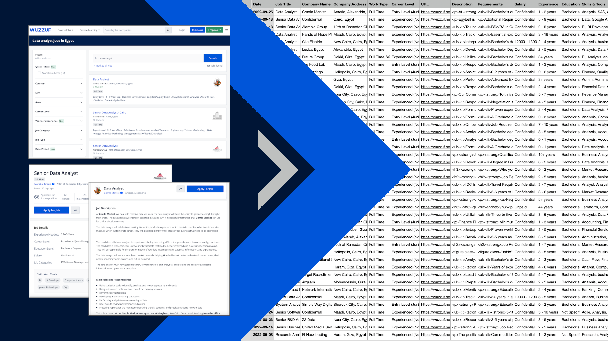

# job-post-scraping

This project uses BeautifulSoup to extract dynamically loaded data from a job listing website.

In a Jupyter notebook, we scrape the job listings for 'Data Analyst' from an Egyptian website called Wuzzuf then extract the information from the listings and store the results in a csv file.

 ## Job Description

This job description was listed on a freelancing website:

> The project goal is to write Python Script to Scrape All Data Analyst Jobs data Posted on Wuzzuf Website Using BeautifulSoup
>
> - I was able to Extract the Job Title, Company Name, Company Address, Job Time, Job Level, Job Link and The period in which the job was posted which is converted to the Post Date and Put all of them in a Spreadsheet
>
> Website - https://wuzzuf.net/search/jobs/?a=navbl%7Cspbl&q=data%20analyst&start=0

Each result will contain - 
 - Date
 - Job Title
 - Company Name
 - Company Address
 - Full-time/Part-time
 - Career Level
 - URL
 - Job Description
 - Job Requirements
 - Salary
 - Required Experience 
 - Required Education
 - Skills/Tools
